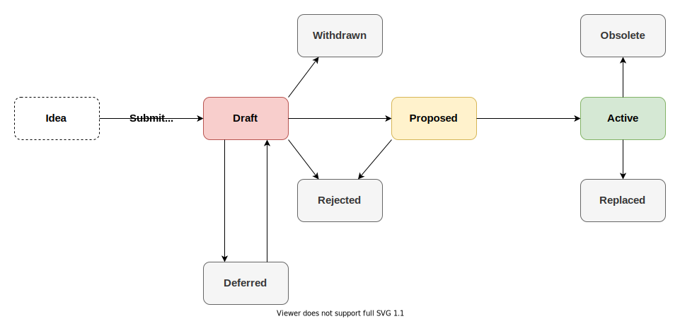

<picture>
  <source media="(prefers-color-scheme: dark)" srcset="logo_dark.svg">
  <source media="(prefers-color-scheme: light)" srcset="logo_light.svg">
  
</picture>

# IOTA Improvement Proposal (IIP) Repository

IIPs are improvement proposals for bettering the IOTA technology stack.

Building the IOTA ecosystem is a community effort, therefore we welcome anyone to propose, discuss and debate ideas that will later become formalized IIPs.

## Propose new ideas

Do you have an idea how to improve the IOTA technology stack?
- Head over to the [discussions](https://github.com/iotaledger/iips/discussions) page to browse already submitted ideas or share yours!
- Once your idea is discussed, you can submit a draft IIP ([template here](https://github.com/iotaledger/iips/blob/main/TEMPLATE.md) as a PR to the repository.
- You will receive feedback from the IIP Editors, core devs and community members to refine your proposal.
- Once accepted, your IIP is merged as Draft.
- It is your responsibility to drive its implementation and to present a clear plan on how the new feature will be adopted by the network.
- Once implementation is ready and testing yields satisfactory result, the IIP becomes Proposed.
- Proposed IIPs that are supported by majority of the network become Active.

You may find more information about the IIP Process in [IIP-1](./iips/IIP-0001/iip-0001.md).

## List of IIPs

 - Last updated: 2026-02-09
 - The _Status_ of a IIP reflects its current state with respect to its progression to being supported on the IOTA Mainnet.
   - `Draft` IIPs are work in progress. They may or may not have a working implementation on a testnet.
   - `Proposed` IIPs are demonstrated to have a working implementation on the IOTA Devnet or Testnet.
   - `Active` IIPs are supported on the IOTA Mainnet.
   - `Replaced` IIPs have been replaced by a newer IIP.
   - `Obsolete` IIPs are no longer in use.

| \# | Title                                                    | Description                                                                        | Type      | Layer     | Status   |
|----|----------------------------------------------------------|------------------------------------------------------------------------------------|-----------|-----------|----------|
| 1  | [IIP Process](iips/IIP-0001/iip-0001.md)                 | Purpose and guidelines of the contribution framework                               | Process   | \-        | Active   |
| 2  | [Starfish Consensus Protocol](iips/IIP-0002/iip-0002.md) | A DAG-based consensus protocol improving liveness and efficiency                   | Standards | Core      | Proposed |
| 3  | [Sequencer Improvements](iips/IIP-0003/iip-0003.md)      | Improved sequencing algorithm for reducing the number of transaction cancellations | Standards | Core      | Active   |
| 5  | [Move View Functions](iips/IIP-0005/iip-0005.md)         | A standardized interface for application-specific queries to on-chain state        | Standards | Interface | Draft    |
| 7  | [Validator Scoring Mechanism](iips/IIP-0007/IIP-0007.md) | An automated and standardized system for monitoring validator behavior and scores  | Standards | Core      | Draft    |
| 8  | [Dynamic Minimum Commission based on the Validator's Voting Power per Epoch](iips/IIP-0008/IIP-0008.md) | A dynamic minimum validator commission rate set to the validator's voting power percentage to prevent stake hoarding and promote decentralization  | Standards | Core      | Draft  |

## Need help?

If you want to get involved in the community, need help getting started, have any issues related to the repository or just want to discuss blockchain, distributed ledgers, and IoT with other people, feel free to join our [IOTA Builder Discord](https://discord.gg/iota-builders).
