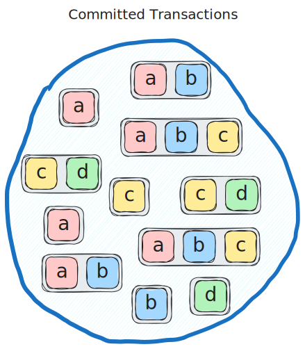

## Abstract
The sequencer is a protocol component that directly follows consensus and is responsible for assigning the order of execution of transactions writing to shared objects. This proposal seeks to improve the sequencing algorithm to make better use of parallel execution capabilities by relaxing the requirement of preserving gas price ordering of transactions that touch **any** common shared object. This requirement is too strict and results in suboptimal use of resources, so our proposal requires instead that gas price ordering must be preserved for transactions that touch **all** the same shared objects. With this relaxed requirement, we can use a sequencing algorithm that always assigns the earliest available parallel execution slot to transactions, making optimal use of resources.

## Motivation
To understand the motivation for the sequencer improvements proposed here, consider the following example.

The consensus module produces a commit containing the following set of transactions without regard for their exact ordering within the commit. The lettered blocks within each transaction indicate that the transaction writes to that shared object. In this example, we have four shared objects, a, b, c and d.

These transactions can then be placed in descending order of gas price where transaction number 1 pays the highest gas price.

The job of the sequencer is to schedule these transactions for execution given a constraint on the total expected execution time for the scheduled transaction from each commit. Transactions that do not write to any common shared objects may be executed in parallel as they do not depend on one another. The current sequencer places an additional constraint on the sequencing that if a pair of transactions write to **any** common shared object, their gas-price ordering must be preserved. As such, the sequencing result in this example is as follows with the current sequencer.

The first three transactions all touch object a, so they must be executed sequentially in their gas price order. Transaction 4 must be executed after transaction 3 in the current sequencer because they both touch object c, so their gas price order must be preserved. It would be feasible to execute transaction 4 in parallel with transaction 1 or 2 because they do not touch any common shared objects, but this would violate the gas price ordering between 3 and 4. Transaction 5 is scheduled after 4, but transaction 6 must be deferred because the cumulative estimate execution time for sequentially executing the previous 5 transactions exceeds the maximum execution duration per commit in this example. Transactions 8, 9 and 11 are all able to be executed in available parallel execution slots without violating the gas price ordering of any transactions that touch common shared objects, but transactions 7 and 10 must also be deferred.

Next, consider the proposed improvement of the sequencing algorithm applied to the same example.

Here we relax the requirement on gas price ordering so it only needs to be preserved if a transaction touches **all** the same shared objects. We assign execution slot for the transactions one by one as before, but now we simply assign the transaction to the earliest available execution slot, meaning the earliest slot where there is no transaction already scheduled that touches any common shared objects. When we get to transaction 4, illustrated in orange here, we can schedule it in parallel to transaction 1 this time. Transactions 5 and 11 can also be scheduled in earlier slots than before this time do to the new algorithm. Additionally, transactions 6 and 10 can now be scheduled instead of being deferred as indicated in red.

## Specification
The proposed algorithm is specified in [this paper](./ICBC_2025_Sequencing.pdf). The paper also provides proofs of a gas price fairness property and of improved performance over the existing algorithm.

## Backwards Compatibility
The proposed sequencing algorithm is not backwards compatible with the existing one, so will need to be implemented as a protocol upgrade with a feature flag to enable the new functionality. This has been done in the implementation referenced below.

## Reference Implementation and Testing
This IIP has been implemented in [this PR](https://github.com/iotaledger/iota/pull/5763) including unit tests for the new functionality with example scenarios. Additionally, the new sequencer has been compared extensively to the old sequencer using a spammer as detailed in [this report](https://github.com/iotaledger/iota-spammer/blob/sequencing-experiments/reports/improved_sequencing.md).

## Copyright
Copyright and related rights waived via [CC0](https://creativecommons.org/publicdomain/zero/1.0/).