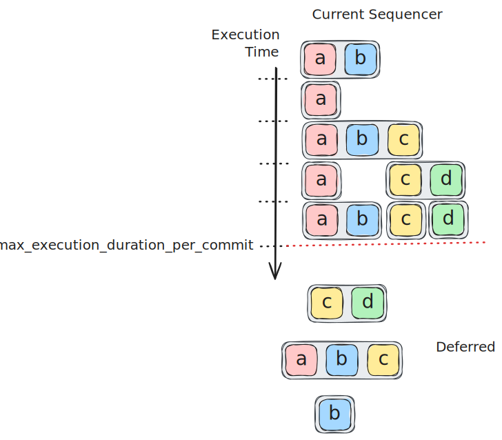
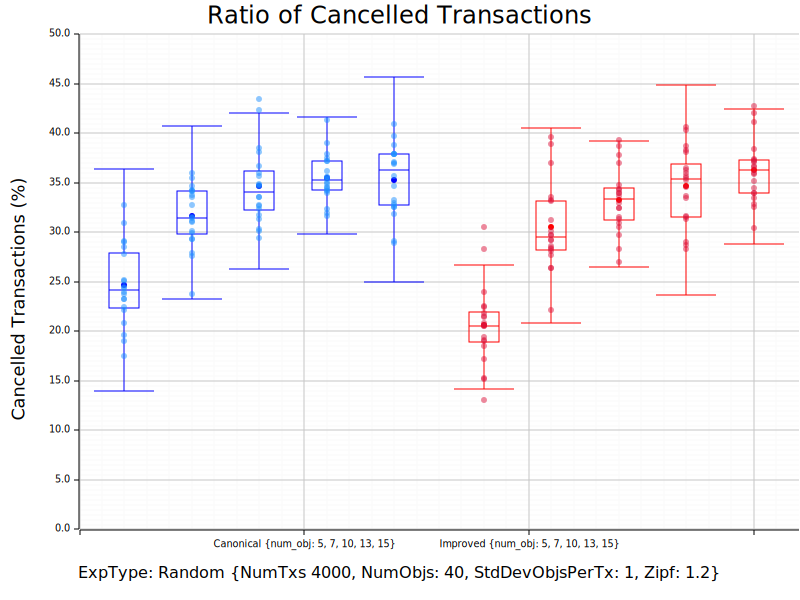

## Abstract
The sequencer is a protocol component that directly follows consensus and is responsible for assigning the order of execution of transactions writing to shared objects.
The current sequencing algorithm requires the preservation of the gas price ordering of transactions that touch **any** common shared object.
This requirement is too strict and results in suboptimal use of resources.
In this IIP, we propose an alternative algorithm that preserves gas price ordering only for transactions that touch **all** the same shared objects.
With this relaxed requirement, we can allow the sequencing phase to order transactions more flexibly, enabling a better resource utilization during execution.
It outputs a new execution order (which may differ from the gas price ordering) for transactions with shared object dependencies without implicitly binding transactions to specific processes.
In the case of both the existing sequencer and this proposal, transactions are passed in the order provided by the sequencer to a simple scheduler module which assigns workers for the execution of each transaction and ensures that a transaction can only begin executing if all transactions touching common shared objects are finished executing.

## Motivation
To understand the motivation for the sequencer improvements proposed here, consider the following example.

The consensus module produces a commit containing the following set of transactions without regard for their exact ordering within the commit. The lettered blocks within each transaction indicate that the transaction writes to that shared object. In this example, we have four shared objects, `a`, `b`, `c` and `d`.

These transactions can then be placed in descending order of gas price where transaction number 1 pays the highest gas price.

Suppose, for the purpose of this example, that each transaction requires one time unit to execute, and for each commit, we want to limit the longest sequential execution to 5 time units to help the execution keep up with the rate of consensus commits. 
We can clearly see that if we executed every transaction sequentially, it would require 11 time units, so 6 of these transactions would need to be deferred.
In fact, we can do much better than this because transactions with no shared object dependencies can be executed in parallel, but we also need to consider preserving the gas-price ordering of transactions to ensure fairness for users.

The job of the sequencer is to determine the execution order of transactions with shared object dependencies given a constraint on the total expected execution time for all sequentially executed transactions within a consensus commit.
The limit placed on expected execution time serves as a congestion control, ensuring that the execution can always keep up with the rate of consensus commits.

## The existing sequencer
The existing sequencer iterates over the transactions in decreasing gas price order and assigns a new order allowing for parallel execution of transactions when they have no shared objects in common. If a pair of transactions write to **any** common shared object, their gas-price ordering must be preserved in this algorithm.
The sequencing result in this example is as follows with the existing sequencer.

The first three transactions all touch `a`, so they must be executed sequentially in their gas price order.
Transaction 4 must be executed after transaction 3 in the current sequencer because they both touch `c`, so their gas price order must be preserved.
It would be feasible to execute transaction 4 in parallel with transaction 1 or 2 because they do not touch any common shared objects, but this would violate the gas price ordering between 3 and 4.
Transaction 5 is placed after 4, but transaction 6 must be deferred because the cumulative estimate execution time for sequentially executing the previous 5 transactions exceeds the maximum execution duration per commit in this example.
Transactions 8, 9 and 11 are all able to be executed in parallel without violating the gas price ordering of any transactions that touch common shared objects, but transactions 7 and 10 must also be deferred.

## The proposed algorithm

In our proposal, we relax the requirement on gas price ordering so it only needs to be preserved if a transaction touches **all** the same shared objects.
We assign the new transaction order one by one as before, but now we simply assign the transaction to the earliest execution start time where there is no transaction already sequenced that touches any common shared objects.
The result for our example is illustrated below.

 The first three transactions are the same as before, but when we get to transaction 4, illustrated in orange here, we can sequence it in parallel to transaction 1 this time, placing transaction 4 in a higher position than transaction 3 because we do not need to preserve their gas price order as they do not touch an identical set of shared objects. Transactions 5 and 11 can also be sequenced in earlier slots than before this time due to the new algorithm. Additionally, transactions 6 and 10 can now be executed instead of being deferred as indicated in red.

## Specification
The proposed algorithm is specified in [this paper](./ICBC_2025_Sequencing.pdf). The paper also provides proofs of a gas price fairness property and of improved throughput compared with the existing algorithm.

## Backwards Compatibility
The proposed sequencing algorithm is not backwards compatible with the existing one, so must be implemented as a protocol upgrade with a feature flag to enable the new functionality. 
This has been done in the implementation referenced below.

## Reference Implementation and Testing
This IIP has been implemented in [this PR](https://github.com/iotaledger/iota/pull/5763) including unit tests for the new functionality with example scenarios. Additionally, the new sequencer has been compared extensively to the old sequencer using a spammer as detailed in [this report](https://github.com/iotaledger/iota-spammer/blob/sequencing-experiments/reports/improved_sequencing.md). 
We present a subset of representative here to make them publicly accessible.

### Experiment Results
The proposed algorithm reduces the number of deferments at each round, which prevents transaction cancellations caused by repeated deferments during periods of congestion. 
To measure the performance of the proposed algorithm in reducing the number of cancellations, we stressed the network using a synthetic transaction set that consists of both directly and indirectly conflicting transactions. 
(An indirect conflict refers to two transactions with disjoint input objects sets that nonetheless both share at least one object with other conflicting transactions.)

The figure below shows the cumulative number of cancellations over time during different trials of an experiment with 4000 transactions for both existing (canonical) and proposed (improved) algorithms. The number of cancellations was reduced by 60% in average.

For comparison, the figure below shows the cumulative number of successfully executed transactions from the same experiment.

Note that the above experiment exemplifies the potential benefits of the improved sequencer well because the pattern of direct and indirect conflicts show the shortcomings of the canonical sequencer.
However, for any consensus commit, the improved sequencer will always sequence at least as many transactions as the canonical sequencer as proven in [this paper](./ICBC_2025_Sequencing.pdf).
To further demonstrate the effectiveness of the new approach, we repeated experiments with transactions whose inputs sets are generated randomly, without controling the ratio of direct/indirect conflicts. 
We note that due to the random nature of the experiments, transactions are most likely to be in direct conflict, meaning there is less room for improvement.
Even in this case, the number of cancellations was reduced by 7% in average. 
The figure below summarizes the comparison between the two algorithms in terms of the average number of cancellations for varying number of objects per transaction. 

## Copyright
Copyright and related rights waived via [CC0](https://creativecommons.org/publicdomain/zero/1.0/).
