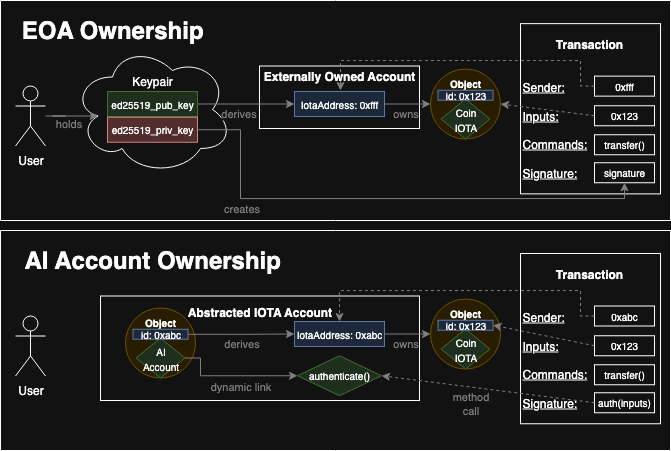
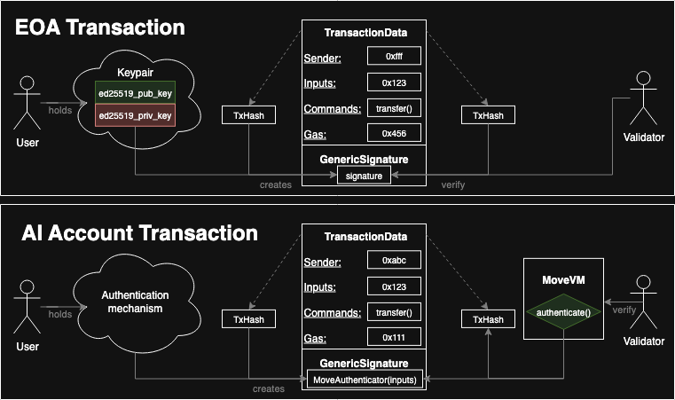
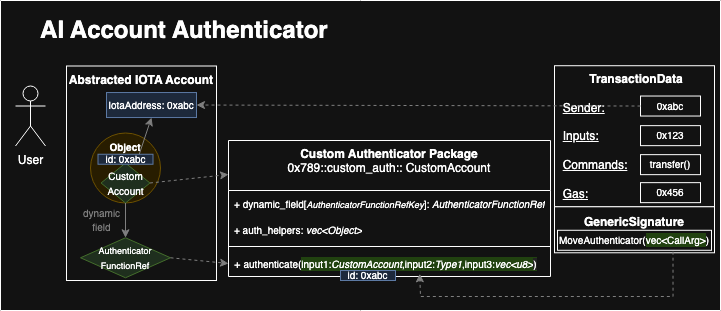
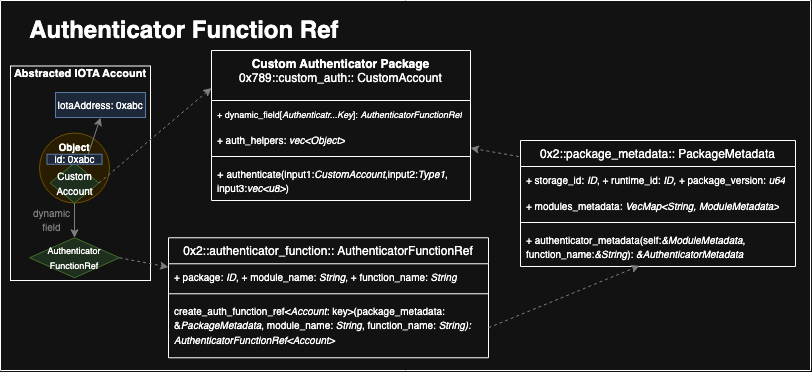

## Abstract
This proposal presents a model for a new account type called the abstract account, which features a stable identifier and programmable authentication. From the viewpoint of decentralized applications (dApps) and their users, this new account type functions similarly to a traditional Externally Owned Account (EOA), i.e., those types of accounts relying on private keys. The primary objective of the abstract IOTA Account is to enable flexible authentication mechanisms while ensuring compatibility with existing infrastructure and maintaining consistent behavior at the protocol level.

## Motivation
The primary aim of this proposal is to greatly improve user experience throughout the IOTA ecosystem by accommodating a diverse range of account authentication methods. This initiative allows for the extensibility of users' authentication while maintaining the integrity of the base protocol, ensuring backward compatibility is not compromised. Consequently, accounts can operate and authenticate without necessarily making use of private keys, and, instead utilizing external inputs or executable code.

Authentication paradigms that are possible to implement with this proposal include, but are not limited to:
 - Arbitrary cryptographic authentication
 - Two-factor authentication (2FA)
 - Dynamic multi-signature schemes
 - Key rotation and recovery options
 - Redundant signing methods
 - DAO governance and treasury management
 - Developer team or admin accounts for secure contract management

## Specification
In this section, we present the technical specification for implementing an Account Abstraction model within the IOTA protocol. A new account type, referred to as the Abstract IOTA (AI) Account, is designed to support flexible, programmable authentication while maintaining full compatibility with existing protocol components. The specification begins by outlining a set of functional requirements the model must satisfy, followed by a high-level overview of the proposed architectural approach.

### Requirements
The proposed Account Abstraction model must adhere to the following constraints:
1. **Stable Address**: Each AI Account must be associated with a stable and persistent address, enabling long-term reference and asset ownership.
2. **Interoperability**: AI Accounts must be capable of interacting seamlessly with any on-chain smart contract, without being restricted to specific protocols, types, or interfaces.
3. **True Abstraction**: dApps must be able to craft and propose transactions to user wallets without distinguishing between AI Accounts and EOAs. The transaction structure and interaction flow should remain identical, such that the dApp is agnostic to the account type it is interacting with.
4. **Identifier Uniqueness**: Each AI Account must be uniquely identifiable. The system must guarantee a one-to-one correspondence between account instances and their associated identifiers.
5. **Programmable Authentication**: Authentication logic must be fully programmable, enabling third-party developers to define and deploy custom authentication schemes tailored to specific application needs.
6. **Backward Compatibility**: The system must preserve the functionality of existing EOAs, including their native signature-based authentication mechanisms.
7. **Open Account Creation**: The creation of AI Accounts must be permissionless, i.e., any entity should be able to initialize an AI Account on behalf of another, provided the intended owner can later authenticate themselves.
8. **API Uniformity**: Developer-facing APIs for querying balances, initiating transfers, and similar operations must behave identically for both AI Accounts and EOAs, promoting transparency and ease of integration.
9. **Transaction Format Consistency**: The format and semantic structure of transaction payloads must remain unchanged. The protocol must handle TransactionData for AI Account transactions identically to legacy EOAs.
10. **Gas Cost Parity**: Current IOTA protocol static signature verification methods and Move-based verification counterparts should be cost-equivalent in terms of gas.

### High-Level Overview
To support AI Accounts, we propose the addition of a new set of modules within the `iota-framework`. These modules define the core data structures and their associated methods for creating and interacting with an AI Account.

#### Account Representation and Addressing
AI Accounts are represented as objects within the IOTA Move framework, each associated with a globally unique 32 byte long `ObjectID`. The `ObjectID` serves as the AI Account Identifier and is itself a valid IotaAddress.

> [!NOTE]
> Digression on IOTA Ownership Model
> 
> Every object in the IOTA Protocol has a [well-defined owner](https://github.com/iotaledger/iota/blob/44f16f273f773ade66b53acf2bb3eccddf5f4170/crates/iota-types/src/object.rs#L550). Only the owner can use their objects as input to a transaction. Current ownership semantics are as follows:
>  - `AddressOwner(IotaAddress)`
>     - `AddressOwner(IotaAddress=PubKey-derived)` – Object owned by a single EOA; it can be set as input of a transaction if the EOA provides a valid signature using the private key associated to the public key from which the `IotaAddress` was derived.
>     - `AddressOwner(IotaAddress=ObjectID)`  - The owner is an `IotaAddress` which is interpreted as an `ObjectID`. Objects are, in essence, owning other objects. To unlock such owned objects, they need to be [received in a transaction](https://docs.iota.org/developer/iota-101/objects/transfers/transfer-to-object#receiving-objects) the first time they are accessed after being transferred.
>  - `ObjectOwner(IotaAddress=ObjectID)` – Object owned by another object, in a hierarchical, parent-child relationship. The owned object can be dynamically accessed in transactions where the parent is used as input. This is used for Dynamic Fields. 
>  - `SharedOwner` – Mutably accessible by any address; it can be set as input of a transaction with no checks.
>  - `ImmutableOwner` – Immutably accessible by any address; it can be set as input of a transaction with no checks.
> 
> While an ownership of type `ObjectOwner` might be tempting to use for an AI Account, since it is indeed an object, it would require further steps and access control logic when objects are being transferred to them. In fact, `ObjectOwner` ownership relationship was set in place, it would require the sender of an object to use the AI Account object as input of the transfer transaction; moreover, it would also require to have mutable access to such AI Account object.
> 
> Employing an `AddressOwner` ownership relation, instead, would allow the sender to just use the address being the AI Account Identifier. Such choice, in practice, makes AI Accounts indistinguishable from EOA addresses.

Ownership of on-chain objects by AI Accounts is expressed using the existing `AddressOwner(IotaAddress)` variant, where the `IotaAddress` is the AI Account Identifier.

Objects transferred to an AI Account Identifier do not require explicit acceptance by the receiver. When set as inputs of a transaction their “unlocking” is done by checking whether the AI Account Identifier is the sender of the transaction, therefore ensuring that the account is authenticated.

Figure 1 depicts how the `AddressOwner(IotaAddress)` ownership variant works for EOA and AI Accounts:



While the ownership models look the same from the outside, they differ significantly at the protocol level:

| Aspect | EOA | Abstract Account |
|---|---|---|
| How is the address of the account derived? | `0xffff` address derived from the EOA public key. | `0xabc` is the `ObjectID` of the object representing the account.<br>`IotaAddress = AIAccountID = ObjectID` |
| Owned object that the transaction wants to unlock (input) | `0x123` with type `Coin<IOTA>`, owner is `0xffff`. | `0x123` with type `Coin<IOTA>`, owner is `0xabc`. |
| Sender field of the transaction | `0xffff` | `0xabc` |
| Signature field of the transaction | Payload containing a valid signature created using the private key (e.g., ED25519). | Payload containing bytes created by logic unknown to the IOTA protocol, but verifiable by a Move `AuthenticatorFunction` that was arbitrarily created by a third-party developer and dynamically linked to the AI Account Identifier. |

#### Move Authenticator

As seen above, AI Accounts are capable of initiating transactions, i.e., the AI Account Identifier can be used as sender of transactions. However, unlike EOAs, whose authentication derives from private key signatures, the AI Account Identifier is not necessarily tied to a specific cryptographic keypair, neither derived from it. Therefore, a new authentication flow is introduced into the protocol to allow the implementation of arbitrary authentication mechanisms in Move: the MoveAuthenticator.

The `MoveAuthenticator` is a protocol-level transaction signature variant that allows transaction senders to submit a vector of arguments in the transaction signature field that are passed to the `AuthenticatorFunction` of the AI Account. This enables third party developers to implement custom programmable authentication schemes using Move.

> [!NOTE]
> Digression on the structure of IOTA transactions
>
> Currently, the structure of IOTA transactions includes:
>  - `TransactionData`: Contains core transaction payload such as Programmable Transaction Blocks (PTB) commands and gas configuration.
> - `GenericSignatures`: A vector of protocol-supported authenticators, currently including `MultiSig`, `Signature`, `ZkLoginAuthenticator (disabled)`, and `PasskeyAuthenticator`.

The proposed addition of `MoveAuthenticator` extends this `GenericSignature` variants set to support dynamic authentication logic. Based on this extension, third party developers can deploy Move packages implementing a custom `AuthenticatorFunction`. An AI Account can then be configured to delegate its authentication to such a package. Inputs to `AuthenticatorFunction` are encoded as `Vec<CallArg>` (where `CallArg` is a type defining pure and object arguments) and provided in the `MoveAuthenticator` signature field. The function either runs successfully or aborts with an error if the authentication fails. 

Figure 2 shows how the different authenticators work for transaction issued by EOA and AI Accounts.



##### (Traditional) EOA Transaction Authentication

In case of EOAs, TransactionData is the payload that makes transactions cryptographically unique. It includes sender, inputs, commands and gas data. Passing the raw bytes of the payload to a hash function yields its digest, i.e., `TransactionDigest`, which becomes the transaction identifier (encoded in base58).

An EOA user signs the `TransactionDigest` with the EOA private key (the description is simplified for the sake of readability). This signature becomes the payload of the `GenericSignature` part of the transaction. Once transmitted to a Validator, such a transaction is authenticated by extracting the sender address and transaction digest from the `TransactionData`, verifying them against the signature: if the verification fails, the transaction is marked as invalid. 

##### Abstract Account Transaction Authentication

In case of AI Accounts, the `TransactionData` part is exactly the same as the EOA case; it necessitates no changes. The difference lies is in the `GenericSignature` part. In there, it can be used a developer-defined mechanism (e.g., a different signature scheme, passkey method or business logic) to generate a proof on the client side that can be validated by the `AuthenticatorFunction` in Move. 

This proof (or set of proofs) becomes the `MoveAuthenticator` payload of the `GenericSignature` field of the transaction. Validators authenticate the transaction by executing the account’s dynamically linked `AuthenticatorFunction` Move function with the proof provided as input argument(s). It is important to note that the `AuthenticatorFunction` has a “rich” context: it has access to the `TxContext` contained in the `TransactionData`, i.e., it knows the `TransactionDigest`, and also accesses the inputs and commands of `TransactionData` using an `AuthContext`. This new `AuthContext` struct allows to parse the information about the PTB included in the `TransactionData`.

Should the execution of `AuthenticatorFunction` fail for any reason, the transaction is marked as invalid.

#### The AI Account Interface

The AI Account representation in Move should be made so that third party developers can implement any arbitrary type. This means that there is no unique AI Account framework object type, but rather, any object type can become an AI Account if it implements a specific interface.

A move type is considered an abstract account if, and only if:
 - It is an object (i.e., a struct type that has key ability and an `id: UID` field),
 - has a dynamic field with key of type `0x2::account::AuthenticatorFunctionRefV1Key` and value of type `0x2::authenticator_function::AuthenticatorFunctionRef`. 

The type `0x2::account::AuthenticatorFunctionRef` contains some fields to uniquely identify an `AuthenticatorFunction` on-chain, defined by an external package. For version 1:

```move
public struct AuthenticatorFunctionRefV1<phantom Account: key> has copy, drop, store {
    package: ID,
    module_name: ascii::String,
    function_name: ascii::String,
}
```

Figure 3 shows how a custom Authenticator Move Package is used for allowing the authentication of a custom AI Account:



In the example above, we imagine a scenario where a developer independently develops the Custom Authenticator package deployed at the address `0x789` (i.e., package id). This package defines the account interface through a module named `custom_auth`. In this module a `0x789::custom_auth::CustomAccount` Move object type is defined, which represents a specific implementation of an AI Account. The `CustomAccount` uses the field `auth_helpers` to store data on chain and it is arbitrarily defined by the developer how the logic of this account should work. 

The only required field necessary to make `CustomAccount` an AI account is a dynamic field using the `0x2::account::AuthenticatorFunctionRefV1Key` key and `0x2::authenticator_function::AuthenticatorFunctionRef` value. This dynamic field entry can only be created, for any object, using a framework method from within the `0x2::account module`, i.e., `create_account_v1`. 

The object with id `0xabc`, once becoming an AI Account, has an authentication method clearly defined by the “attached” `AuthenticatorFunctionRef`. This struct is used to reference a specific function within a class of Move functions, i.e., the `AuthenticatorFunction`. In the example, it references the `0x789::custom_auth::authenticate` function defined in the same module. 

#### The Authenticator Function 

The `AuthenticatorFunction` is thought to be as generic as possible, in order to allow third party developers to implement any arbitrary authentication logic. For instance, in the above example, the `CustomAccount` object's field `auth_helpers` can be used in the `AuthenticatorFunction`. Such field contains some on-chain data that could have been modified be by other parties before the authentication. In general, an `AuthenticatorFunction` receives inputs and can read from the ledger state in order to allow or reject access to the AI Account. The `vec<CallArg>` passed through the `MoveAuthenticator` payload of the `GenericSignature` part of the transaction is converted into function parameters similarly to what happens today for PTBs. 

The current rules to create an `AuthenticatorFunction` are: 
 - to only use read-only inputs, which are either [pure types](https://docs.iota.org/developer/ts-sdk/typescript/transaction-building/basics#pure-values) (integers, Strings, etc.) or read-only references to objects; moreover, Owned Objects cannot be passed as input to such functions, but only Shared Objects and Immutable Objects are allowed;
 - to set, as first parameter, the same Move type as the type of the AI Account being authenticated; moreover, the object id of the argument passed for this parameter must be exactly equal to the AI Account Identifier, i.e., the sender of the transaction;
 - to set no return type; the function must either abort due to a custom error or finish the execution without errors; 
 - to be a public non-entry function;
 - to set as second to last parameter `AuthContext` (immutable reference) and as last parameter `TxContext` (immutable reference); the `AuthContext` struct exposes the underlying transaction fields (PTB inputs and commands) while `TxContext` exposes the underlying transaction digest, gas parameters, and sponsor details; these contexts are not created by the user, but, instead, the protocol automatically creates and injects them before executing the `AuthenticatorFunction`; the presence of `AuthContext` makes it such that an `AuthenticatorFunction` cannot be invoked within Move by other methods.

From the protocol point of view, the `AuthenticatorFunction` is invoked twice during the transaction lifecycle:
 1. Optimistic Pre-Consensus Authentication:
    - Upon receiving a transaction, all validators execute the `AuthenticatorFunction` related to the TX’s sender account with any shared object read-only reference or pure inputs.
    - If the pre-consensus authentication passes, then the TX is treated as any other, i.e., the TX’s owned objects (gas payment objects and the TX inputs) are locked and the validator signature needed for a certificate is returned.
    - In this phase, no state modifications could happen, i.e., no gas is paid for the execution of the authentication.  
 2. Post-Consensus Authentication Execution:
    - Once the transaction is ready for the post-consensus execution, the `AuthenticatorFunction` is executed for the second time immediately before the normal execution.
    - The gas object versions for the gas payment are guaranteed for post-consensus execution since majority of validators locked those gas objects.
    - In this second phase, `AuthenticatorFunction` execution can still fail because of some changes happened to the possible input shared objects. In this case the authentication gas cost is deducted, but no other state changes are committed to the ledger and the transaction execution result is ABORTED.
    - Gas costs for authentication in non-sponsored transactions are deducted from an AI Account’s gas object. Sponsored transactions cover authentication costs via gas payment objects owned by the sponsor.

#### Creating AuthenticatorFunctionRef

The `AuthenticatorFunctionRef`, as seen above, is a struct that uniquely identifies a function from within a package deployed on-chain. It is enbled via the Package Metadata Standard (see IIP-00 TODO).



Continuing using the same example seen in the previous sub-section, we can still consider the `CustomAuthenticator` package. When this is published in the ledger, an associated `PackageMetadata` immutable object is created. Such immutable object contains metadata for each module, thus also for functions found in the `0x789::custom_auth module`. Particularly, the `0x789::custom_auth::authenticate` function will be considered as “authenticator“ within the `PackageMetadata` object. To be considered as “authenticator“ a function must follow the rules listed in the previous sub-section and use a function attribute being `#[authenticator]`. In fact, not all functions in a package can be considered an authenticator. 

The `PackageMetadata` object acts as a source of validation. This object is created by the protocol while a package is being published. During the publishing, if an `#[authenticator]` attribute is found for a function, then the protocol validates that function using the `iota-move-verifier`. Since `PackageMetadata` is an immutable object and can be only created by the protocol, no one else can forge such an object with an illegal authenticator function. 

Thus, given the trust in the information found in a `PackageMetadata`, an `AuthenticatorFunctionRef` can be easily created by passing a `PackageMetadata` object as input. The function `0x2::authenticator_function::create_auth_function_ref` takes a `PackageMetadata`, a module name and a function name and checks whether these inputs would resolve to an authenticator function; if so, it will return an `AuthenticatorFunctionRef`. Such reference is then be used to create an account.

## Rationale
This specification introduces a flexible, developer-centric model for account abstraction that preserves compatibility with the existing transaction format and authorization model. By leveraging Move's programmability and object-oriented design, the system supports a wide range of use cases—from key rotation and passwordless login to DAO-based access control and cross-device passkey authentication.

Alternative models—such as static multisignature schemes or fixed key lists—were deemed insufficient due to their lack of adaptability to dynamic and composable use cases. In contrast, the AI Account model integrates tightly with the Move-based models for asset management.

Similar models have emerged in other blockchain ecosystems, such as Ethereum’s ERC-4337 and Aptos’ dynamic dispatch system. However, this proposal is uniquely tailored to the IOTA protocol's architecture, emphasizing on-chain object ownership, deterministic addressing, and native MoveVM integration.

## Backwards Compatibility
 - Transaction Format: No changes are made to the transaction data structure.
 - Signature Support: A new authenticator is added alongside the existing variants in GenericSignature.
 - Validation Pipeline: An optional AuthenticatorFunction hook is introduced for the transaction validation and pre-PTB execution.
 - RPC and Wallet APIs: These remain unchanged. AI Accounts are fully compatible with existing APIs and indistinguishable from EOAs. Wallets that want to support the new account type however need to add support for each authenticator type that is defined on-chain in order to know how to derive the bytes supplied to the MoveAuthenticator .

## Test Cases
 - Replication of single-key cryptographic EOAs, with support for key rotation
 - Dynamic multisig authentication based on signatures or capabilities
 - Gas sponsorship Move authenticators
 - DAO-based authentication via on-chain voting
 - Third-party authentication

TODO: link to implemented test cases

## Reference Implementation
TODO: Link to implementation PR

## Copyright
Copyright and related rights waived via [CC0](https://creativecommons.org/publicdomain/zero/1.0/).
