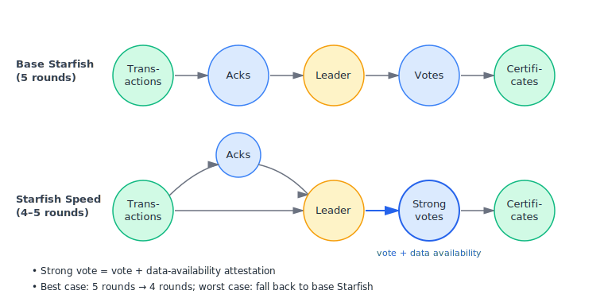
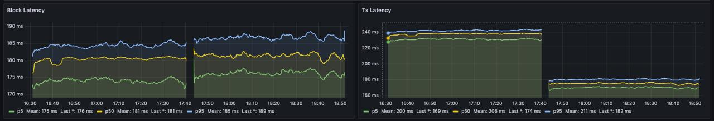

## Abstract

Starfish Speed is an optimistic extension of [Starfish](../IIP-0002/iip-0002.md). Each voter attaches a *strong vote* to its round-(r+1) vote for the round-r leader, attesting that the voter has the full payload of the leader block and of every block the leader acknowledges. A quorum of such strong votes lets the leader's acknowledged payloads be sequenced at commit time, instead of waiting for separate data-availability certificates to accumulate. The commit rule is extended with a metastate that distinguishes *optimistic* commits (which sequence the leader's acknowledged payloads immediately) from *standard* commits (which behave as in base Starfish).

## Motivation

Unlike its predecessors (e.g. Mysticeti), Starfish decouples block headers from payloads and only sequences a payload after a Data Availability Certificate (DAC) is observed. Each acknowledged payload must therefore wait at least one extra round for its DAC to accumulate. In the happy case, however, the leader and most honest voters already hold the payloads the leader acknowledges, so this extra wait is pure latency overhead.

Starfish Speed removes that overhead on the optimistic path while preserving Starfish's safety and liveness guarantees: payloads in `L.acks` are sequenced at the same latency as the base commit of `L` — matching Mysticeti's per-payload latency. When the optimistic conditions are not met, the protocol falls back to base Starfish behaviour.

In effect, Starfish Speed combines the best of both protocols: it inherits Starfish's robustness — Reed-Solomon-encoded payload dissemination and the push-based DAG that decouples headers from transactions — while matching Mysticeti's commit latency in the happy case.

## Specification

Starfish Speed modifies Starfish in the following places:

- **Block Header.** A `strongVote` field is added. In a round-(r+1) block voting for the round-r leader `L`, the strong vote *attests to data availability* iff the voter holds the full payload of `L` and of all blocks in `L.acks`; otherwise it does not. The commit rules depend only on this attestation; the on-wire encoding is an implementation detail.
- **Pacemaker.** Block creation gains an optimistic strong path: before a tunable timeout `δ_ST`, a party may create its block once it has `L`'s payload, all payloads in `L.acks`, and either 2f+1 attesting strong votes for the previous leader or a skip-pattern quorum. After `δ_ST`, the base-Starfish weak path applies. The hard timeout (`δ_LT = 2Δ`) and catch-up rule are unchanged.
- **Strong Quorum Certificate (StrongQC).** A round-(r+2) block carries a StrongQC for `L_r` iff its causal history contains 2f+1 round-(r+1) blocks from distinct parties that vote for `L_r` with strong votes attesting to data availability. A *strong blame quorum* (2f+1 round-(r+1) voters for `L_r` whose strong votes do not attest) is mutually exclusive with a strong vote quorum.
- **Slot Metastates.** `Commit` slots gain a metastate: `opt` if a quorum of StrongQCs is observed at round r+2, `std` if a strong blame quorum is observed at round r+1, otherwise `pend`. `pend` slots are committed (they never become `Skip`) but block sequencing until the indirect rule resolves them to `opt` or `std` using the next committed anchor.
- **Sequencing.** For `Commit(std)` slots, append `hist_DA(L)` as in base Starfish. For `Commit(opt)` slots, append `hist_DA(L)` then `L.acks`. Sequencing stops at the first `Commit(pend)` or `Undecided` slot.

Starfish Speed is gated by a protocol flag (`consensus_starfish_speed`) and activated together with the new block header version (`BlockHeaderV2`) and commit message version (`Commit V3`). Wrong-version blocks and commits are rejected when the flag state does not match.

## Rationale

- **Strong vote semantics.** Requiring the voter to hold `L.payload` and every payload in `L.acks` makes a StrongQC equivalent to a DAC for all acknowledged payloads: at least f+1 honest parties already hold them at commit time.
- **Mutual exclusivity of strong quorums.** Quorum intersection and the f-Byzantine bound make strong-vote and strong-blame quorums mutually exclusive, giving a deterministic `opt`/`std`/`pend` classification without dispute resolution.
- **`pend` metastate.** A `pend` slot is committed but non-final. It blocks sequencing like `Undecided`, but unlike `Undecided` it serves as a committed anchor for the indirect rule, avoiding cascading-undecided.
- **Two-tier pacemaker.** The optimistic timeout `δ_ST` prevents a single slow validator from indefinitely blocking block creation; the weak fallback restores base-Starfish progress conditions, so liveness reduces to the base-Starfish liveness argument.

## Backwards Compatibility

Starfish Speed is not compatible with Starfish at the block-header, commit-message, or linearization level: `BlockHeaderV2` carries the new `strongVote` field, `Commit V3` carries the metastate annotations, and `Commit(opt)` slots sequence `L.acks` immediately whereas base Starfish would defer them.

**Mitigation.** Activation is atomic via the `consensus_starfish_speed` protocol flag at an upgrade boundary; block and commit versions are validated against the flag. When the flag is disabled, behaviour is identical to [IIP-2](../IIP-0002/iip-0002.md).

## Test Cases

In addition to the existing Starfish test suite, the implementation should cover: correct computation of `strongVote` (including empty `L.acks` and missing-payload cases); direct classification into `Commit(opt)`, `Commit(std)`, and `Commit(pend)` for the corresponding DAG patterns; indirect resolution of `pend` slots via anchors; the mutual-exclusivity invariant; and slow-validator scenarios where the optimistic path degrades to the weak fallback without harming liveness.

## Reference Implementation

A reference implementation is available on the [`consensus/feat/starfish-speed`](https://github.com/iotaledger/iota/tree/consensus/feat/starfish-speed) branch of `iotaledger/iota`. It extends the existing Starfish consensus crate with `BlockHeaderV2`, `Commit V3`, strong-vote computation, the optimistic linearizer path, and the `consensus_starfish_speed` protocol flag.

The figure below compares base Starfish (left half of each panel) with Starfish Speed (right half) on a 19-validator network. Block commit latency is roughly unchanged (left panel, p50 ≈ 181 ms in both regimes), while transaction commit latency drops from ≈ 206 ms (p50) under base Starfish to ≈ 174 ms under Starfish Speed — the ~15% optimistic-path win expected from folding the data-availability acknowledgment into the leader vote.

## Copyright

Copyright and related rights waived via [CC0](https://creativecommons.org/publicdomain/zero/1.0/).
